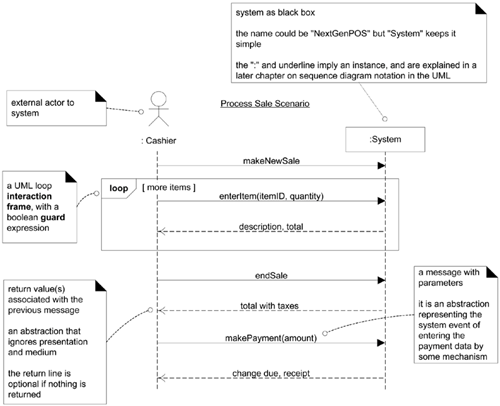

# R1M1

This repository contains examples of use cases, domain models, system sequence diagrams (SSDs), operations contracts, vision, supplementary specification and glossary. Examples and images are taken from: Applying UML and Pattern 3rd edition. 

---
## Use Cases

**What**

Use cases are **text stories** where an actor (e.g. player) using a system (Need for Spear game).  

**Why**

The goal is to discover and record functional requirements (system behaviours).

**How**

By writing stories of using the system to fulfill user goals. 

### **Terminology**

**Actor**: Something with behaviour. There are three kinds of actors: 

- Primary Actor: This actor has goals to achieve by using the system. For example, player wants to hit the obstacles.
- Supporting Actor: This actor provides a service to the system. For example, a database service to save the contents of the game.
- Offstage Actor: This actor has an interest in the behavior of the use case, but is not primary or supporting. For example, let's say you are selling items in your game. When a primary actor wants to buy an item in your game, the government wants to tax you as an offstage actor.

**Scenario**: A sequnce of interactions between an actor and a system.

**Use Case**: Collection of scenarios that describe an actor using a system to achieve a goal. 

---
### **Fully Dressed Style Use Case Example**

Example from Applying UML and Pattern 3rd edition:

  <b>Use Case UC1: Process Sale</b>

**Scope**: NextGen POS application

**Level**: User goal

**Primary Actor**: Cashier

**Stakeholders and Interests**:

- Cashier: Wants accurate, fast entry, and no payment errors, as cash drawer shortages are deducted from his/her salary.
- Salesperson: Wants sales commissions updated.
- Customer: Wants purchase and fast service with minimal effort. Wants easily visible
display of entered items and prices. Wants proof of purchase to support returns.
- Company: Wants to accurately record transactions and satisfy customer interests.
Wants to ensure that Payment Authorization Service payment receivables are recorded.
Wants some fault tolerance to allow sales capture even if server components (e.g.,
remote credit validation) are unavailable. Wants automatic and fast update of accounting
and inventory.
- Manager: Wants to be able to quickly perform override operations, and easily debug
Cashier problems.
- Government Tax Agencies: Want to collect tax from every sale. May be multiple
agencies, such as national, state, and county.
- Payment Authorization Service: Wants to receive digital authorization requests in the
correct format and protocol. Wants to accurately account for their payables to the store.

**Preconditions**: Cashier is identified and authenticated.

**Postconditions**: Sale is saved. Tax is correctly calculated. Accounting and Inventory are updated. Commissions recorded. Receipt is generated. Payment authorization approvals are recorded.

**Main Success Scenario**:

1. Customer arrives at POS checkout with goods and/or services to purchase.
2. Cashier starts a new sale.
3. Cashier enters item identifier.
4. System records sale line item and presents item description, price, and running total. Price calculated from a set of price rules.
Cashier repeats steps 3-4 until indicates done.
5. System presents total with taxes calculated.
6. Cashier tells Customer the total, and asks for payment.
7. Customer pays and System handles payment.
8. System logs completed sale and sends sale and payment information to the external Accounting system (for accounting and commissions) and Inventory system (to update inventory).
9. System presents receipt.
10. Customer leaves with receipt and goods (if any).

**Alternative Scenarios**:

***a**. At any time, Manager requests an override operation:

1. System enters Manager-authorized mode. Manager or Cashier performs one Manager-mode operation. e.g., cash balance change, resume a suspended sale on another register, void a sale, etc. System reverts to Cashier-authorized mode.

***b**. At any time, System fails:
To support recovery and correct accounting, ensure all transaction sensitive state and events can be recovered from any step of the scenario.

**3b**. There are multiple of same item category and tracking unique item identity not important (e.g., 5 packages of veggie-burgers): 
1. Cashier can enter item category identifier and the quantity.

**Special Requirements**:

- Touch screen UI on a large flat panel monitor. Text must be visible from 1 meter.

**Technology and Data Variations List**:

**3a**. Item identifier entered by bar code laser scanner (if bar code is present) or keyboard.

**Frequency of Occurrence**: Could be nearly continuous.

---
## Domain Models

**What**

Visual representation of your system.

**Why**

Can be source of inspiration for designing some software objects.

**How**

By drawing conceptual classes and their interactions. Illustrated with a set of class diagrams in which no methods are defined. 

Can show:

- Conceptual classes
- Associations between conceptual classes
- Attributes of conceptual classes

### **Example**

---
## System Sequence Diagrams (SSDs)

**What**

Illustrates input and output events of a scenario in a use case.

**Why**

Helps us understand how an actor interact with the system we are developing to achieve a goal.

**How**

By illustrating the timeline of events happening. You can think vertical dashed lines as timeline.

### **Example**

Another example: [SSD Example](https://www.youtube.com/watch?v=XIQKt5Bs7II&ab_channel=Lucidchart)

---
## Operation Contracts

**What**

Sketch to show pre and post condition of a domain model as result of a system operation.

**Why**

Helps us to design the system behaviour for an operation.

**How**

By specifying pre and post conditions.

### **Example**

**Operation**: enterItem(itemID: ItemID, quantity: integer)

**Cross References** (Use cases that this operation can occur): Process Sale Use Case

**Preconditions** (Assumptions): There is a sale underway.

**Postconditions** (State of the domain model objects after completion):

- A SalesLineItem instance sli was created (instance creation).
- sli was associated with the current Sale (association formed).
- sli.quantity became quantity (attribute modification).
- sli was associated with a ProductDescription, based on
itemID match (association formed).

---
## Vision

An executive summary that briefly describes the project, as a context for the major players to establish a common vision of the project. This is what you give when there is a new team member joins to the project.

---
## Supplementary Specification

You define your non-functional requirements here. It may include:

- Hardware, software constraints
- Development constrations
- Internalization concerns (languages, units etc.)
- Licencing, legal concerns
- Packaging
- Standards that you use. 

---
## Glossary

Basically a data dictionary. You define the terms (validation rules, acceptable values etc.) here.
